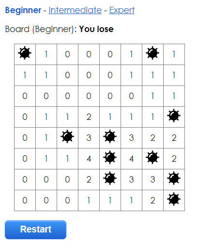

# Minesweeper built in Angular

[Play the game](https://elie29.github.io/angular-minesweeper/)

## Development
All custom code lives in /src/app

* `npm install` to install dependencies
* `npm start` to do live development reload
* `npm run build` to build
* `npm run build:github`: to build for github page https://angular.io/guide/deployment#deploy-to-github-pages

Visit : [Minesweeper](https://elie29.github.io/angular-minesweeper/)
